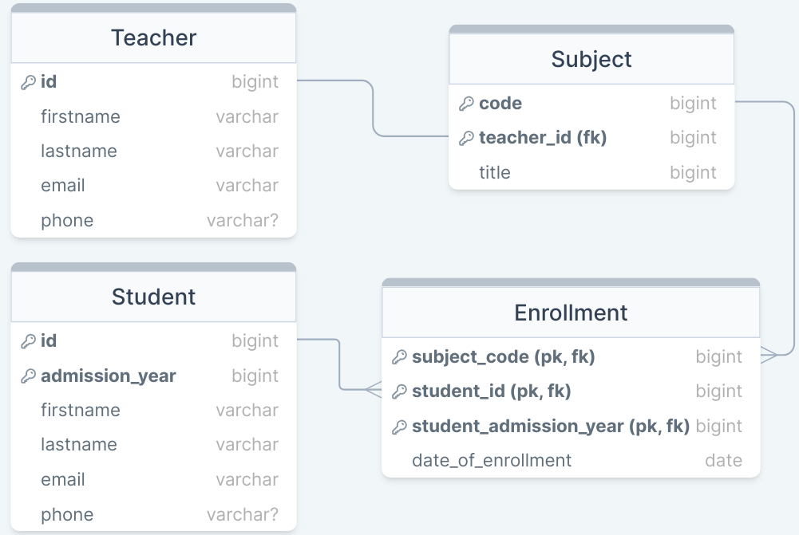

<h1 align = "center"> 

SpringBoot-Data-JPA  

</h1>

Learning Spring Boot JPA (_Java Persistence API_).

## ER Diagram

## Dependencies & Requirements

- Spring Data JPA
- MySQL Driver
- Spring Web
- ~~Lombok~~

Spring Boot: 3.2.5

Java: 22

## Running

daw

## More

For more about this project check file: <a href="./SpringBootJPA.md">SpringBootJPA.md</a>