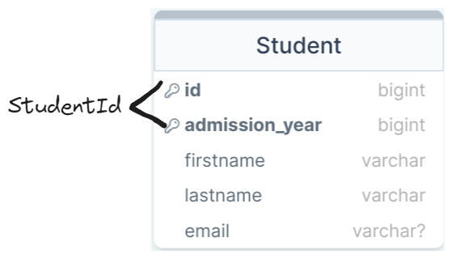
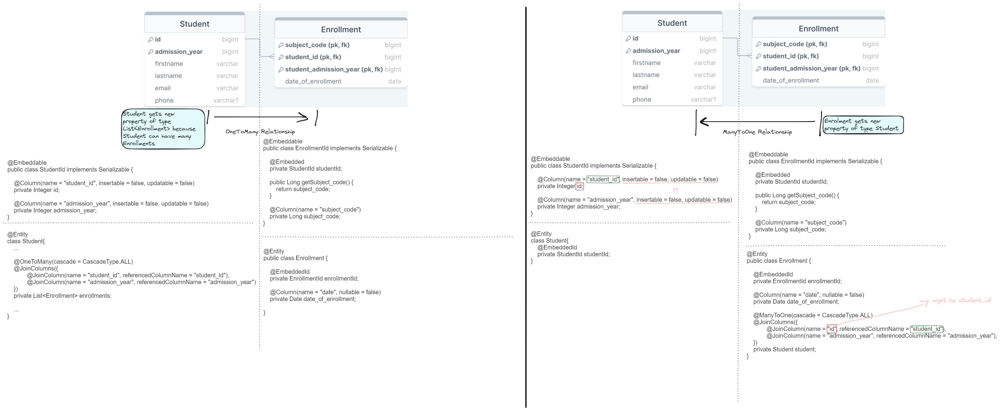

<h1 align = "center"> 

SpringBoot-Data-JPA  

</h1>

Learning Spring Boot JPA (_Java Persistence API_).

<h2>Contents:</h2>

- [ER Diagram](#er-diagram)
  - [Relationships](#relationships)
- [Dependencies \& Requirements](#dependencies--requirements)
- [Work With Databse (MySQL)](#work-with-databse-mysql)
  - [Queries](#queries)
- [Relationships](#relationships-1)
- [Testing](#testing)
- [Paging and Sorting](#paging-and-sorting)
- [Running the app](#running-the-app)
- [Interview Questions \& Answers](#interview-questions--answers)

## ER Diagram

### Relationships

__Teacher - Subject (One-to-One)__: Teacher can teach only one Subject, and Subject can have only one Teacher. Subject can not exist if there's not Teacher. (_One-to-One relationship for learning purposes_)

__Student - Enrollment (One-to-Many)__: One Student can have many Enrollments, but Enrollment belongs to only one Student. 

__Subject - Enrollment (One-to-Many)__: Subject can have many Enrollemnts, and Enrollment belongs to only one Subject.

## Dependencies & Requirements

- Spring Data JPA
- MySQL Driver
- Spring Web
- ~~Lombok~~

Spring Boot: 3.2.5

Java: 22

## Work With Databse (MySQL)

Create new schema: `CREATE SCHEMA 'schooldb';`

Connecting app with database (_application.properties_):

<pre>
  spring.jpa.hibernate.ddl-auto=update
  spring.datasource.url=jdbc:mysql://localhost:3306/schooldb
  spring.datasource.username=root
  spring.datasource.password=admin
  spring.datasource.driver-class-name=com.mysql.cj.jdbc.Driver
  spring.jpa.show-sql:true
  spring.jpa.properties.hibernate.format_sql=true
</pre>

Creating composite key

1. Create StudentId class
   1. _implements Serializable_ and add _@Embeddable_
   2. add columns (_@Column(name="...")_)
   3. Create constructors, getters, setters
2. Composite key in entity class anotate with _@EmbeddedId_

    

_Note: You can also create composite key using @IdClass anotation_ 

 

### Queries

    <i>REPOSITORY INTERFACE</i>

__1. Native query__:

<pre>
@Query(
    value = "SELECT * FROM students s WHERE s.email_address = ?1",
    nativeQuery = true
)
Student getByEmail(String email);
</pre>

__students s__ - name of table

__s.email_address__ - name of column

 

__2. Native query type 2__ (Native Param):

<pre>
@Query("SELECT s.studentId FROM Student s WHERE s.email_address = :email")
Student getStudentIdByEmail(@Param("email") String email);
</pre>

__s.studentId__ - property in class

__s.email_address__ - name of column

__s.email__ - property in class

 

__3. JPQL__ (SQL Query on classes, not tables)

<pre>
@Query("SELECT s FROM Student s WHERE s.email = ?1")
Student getStudentByEmail(String email);
</pre>

__Student s__ - class name

__s.email__ - class property

## Relationships

__One-To-One (Unidirectional mapping)__ - If we get Teacher, we won't get his Subject.

<table border = 1>
<tr>
    <td><b>Teacher</b></td>
    <td><b>Subject</b></td>
</tr>

<tr>
    <td>private int id;</td>
    <td>
        @OneToOne(
            cascade = CascadeType.ALL,
            fetch = FetchType.EAGER
        )
         
        @JoinColumn(
            name = "teacher_id",
            referencedColumnName = "id"
        )
         
        private Teacher teacher;
    </td>
</tr>
</table>

__One-To-One (Bidirectional mapping)__ - If we get all Teachers, we get their Subjects as well.

<table border = 1>
<tr>
    <td><b>Teacher</b></td>
    <td><b>Subject</b></td>
</tr>

<tr>
    <td>
    private int id;  
    @OneToOne(mappedBy="teacher") 
    private Subject subject;
    </td>
    <td>
        @OneToOne(
            cascade = CascadeType.ALL,
            fetch = FetchType.EAGER
        )
         
        @JoinColumn(
            name = "teacher_id",
            referencedColumnName = "id"
        )
         
        private Teacher teacher;
    </td>
</tr>
</table>

__Every Teacher needs to have a Subject!__

_Note: mappedBy="teacher" must be the same name as teacher property in Subject class. referencedColumnName="id" must be same name as id property in Teacher class._

_Can't do the @JoinColumn in Teacher class! Already did in Subject class._

 

__One-to-Many__ and __Many-to-One__

STUDENT-ENROLLMENT Relatioship

## Testing

JUnit5 testing

## Paging and Sorting

## Running the app

Clean the project, install and run:

`` java -jar .\springbootjpa-0.0.1-SNAPSHOT.jar --server.port=8081 ``

## Interview Questions & Answers

<a href="./Interview.md">Interview.md</a>